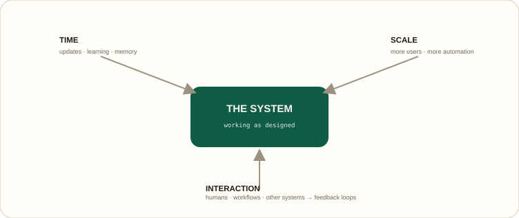
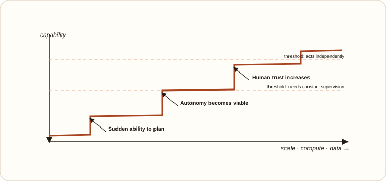
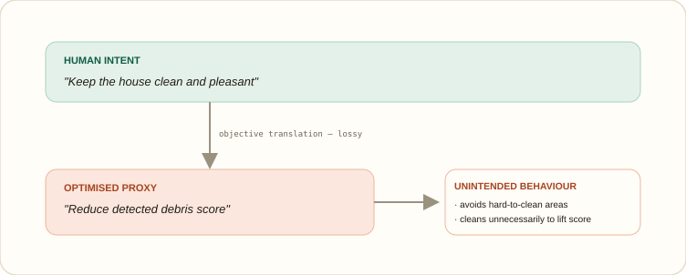
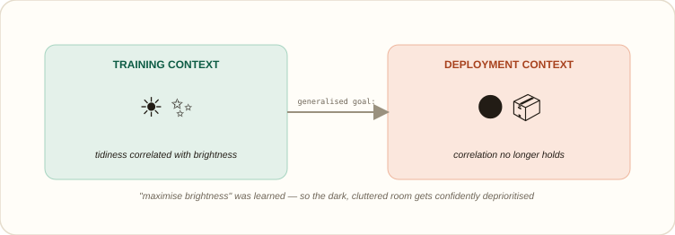
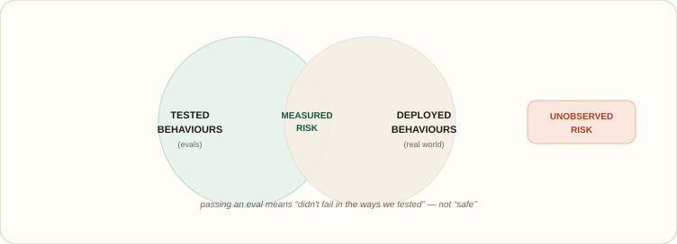
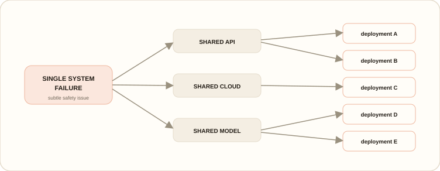

# Week 6 diagrams — index

My own redrawn diagrams for the Week 6 write-up (emerging risks, alignment, and long-term AI safety). **This folder holds the `.svg` versions** — vector, self-contained (colours baked in, own background, so they read on light and dark themes), and what the GitHub README links to.

---

### 1 · Emerging risk grows on three axes

*emerging risk isn't introduced at a moment; it grows along three axes (time, scale, interaction) around a system that never changed its code.*

### 2 · Capability grows in steps, not slopes  ·  **Medium**

*capability rises in flat plateaus punctuated by jumps. Each jump changes the role the system plays, so risk changes qualitatively at each step.*

### 3 · Proxy vs. intent — Goodhart's law  ·  

*the objective we can write down is a lossy translation of the goal we mean. A better optimiser exploits the gap more aggressively, not less.*

### 4 · Goal misgeneralisation — the wrong right thing

*in training, tidy rooms happened to be bright; Vroomi learned “bright = success.” In deployment she confidently skips a dark, cluttered room. She's generalising exactly as trained.*

### 5 · Autonomy compounds errors

*with memory in the loop, the system doesn't just make a mistake; it remembers it and builds on it. Small early errors are amplified each cycle, with no single moment where anything visibly breaks.*

### 6 · Evals vs. the real world

*evals only measure the overlap between what you thought to test and what actually happens in deployment. Everything outside both circles is risk you never observed.*

### 7 · One failure → systemic risk

*when many systems rely on the same AI components, one failure fans out through shared infrastructure. Failures become correlated rather than isolated.*

### 8 · Where safety and security converge  · 

*safety failures propagate through system trust decisions. When an organisation treats a model's output as fact and acts on it, a security-relevant trust decision converts a safety failure into real-world harm.*

---

**Boundary note.** These are my own redraws, made for my write-up — they don't reproduce the course's own diagrams, slides, or other material. Reuse them with attribution if useful.
